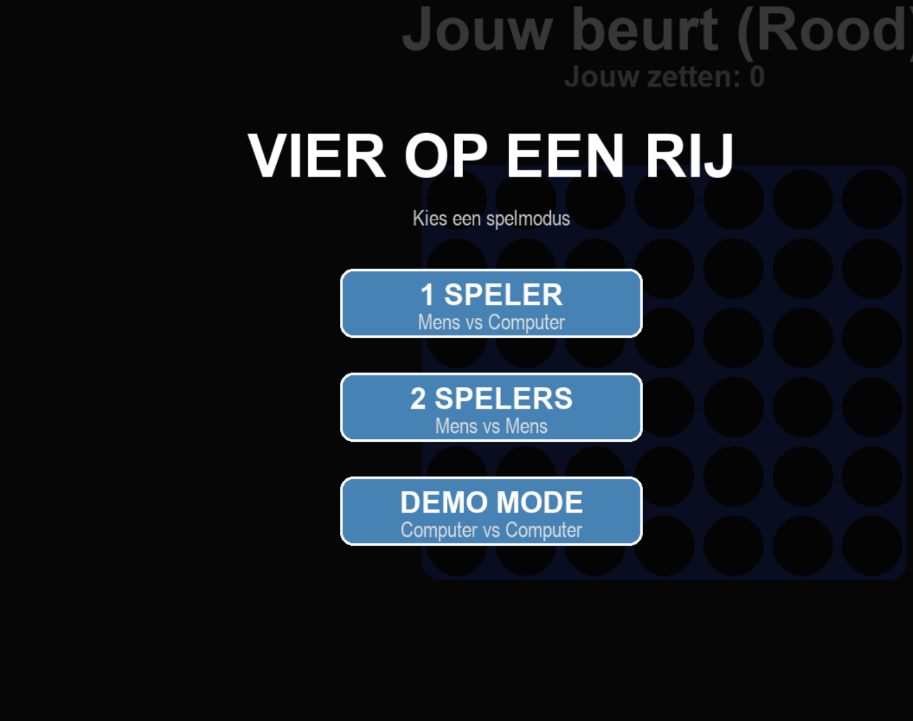
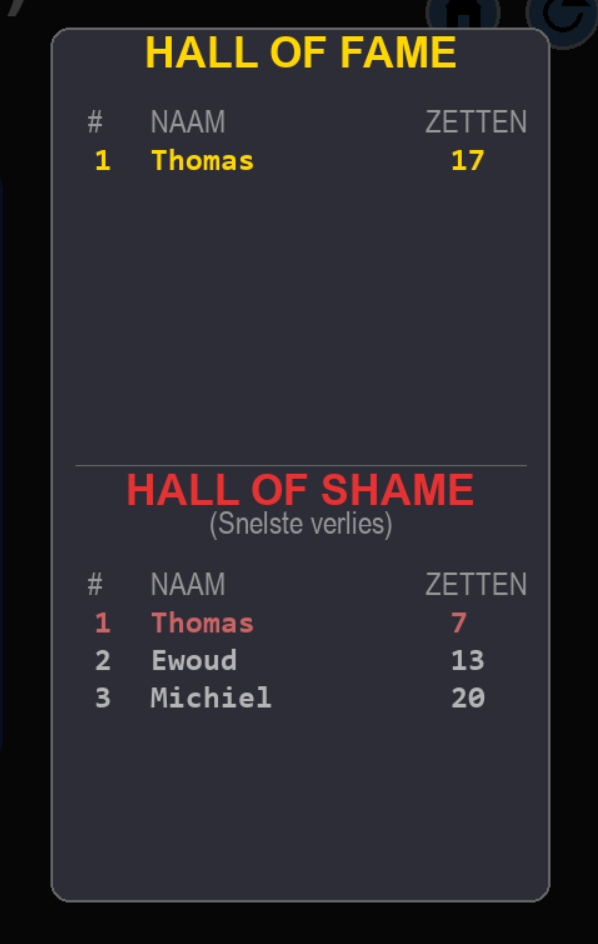
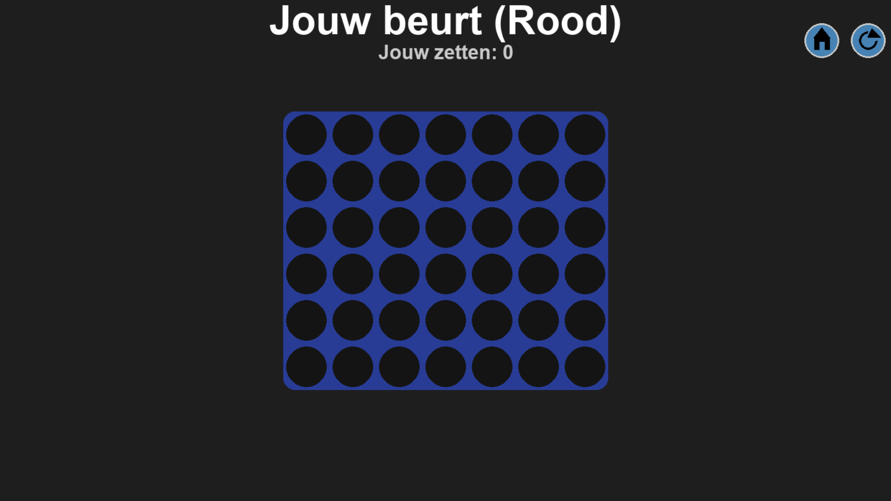

# Resultaat
In dit project hebben we verschillende belangrijke onderdelen ontwikkeld die samen een complete, speelbare en 
gebruiksvriendelijke game vormen. De belangrijkste onderdelen zijn:

1. Een hoofdmenu met drie spelmodes
2. Een leaderboard voor winnaars en verliezers
3. Geluidseffecten in de game
4. Animaties en visuele effecten
5. Een AI-tegenstander
6. Een overzichtelijke interface en bediening

In de volgende secties wordt elk onderdeel verder uitgewerkt.

## 1.  Hoofdmenu met drie spelmodes

Het project bevat een duidelijk hoofdmenu waarin spelers kunnen kiezen uit drie verschillende spelmodi: Player tegen AI, Player 
tegen Player en AI tegen AI. Dit menu vormt de start van de hele game en bepaalt hoe het spelverloop verder gaat. Spelers kunnen 
zo zelf kiezen of ze tegen elkaar willen spelen, tegen de computer, of een volledig geautomatiseerde simulatie willen zien.

## 2. Leaderboard voor winnaars en verliezers

De game beschikt over een automatisch werkend leaderboard waarin per potje wordt bijgehouden wie er heeft gewonnen of verloren. 
Na afloop voert de dezelfde naam speelt, wordt de bestaande score alleen overschreven als de nieuwe prestatie beter (bij winst) 
of juist slechter (bij verlies) is.

Een voorbeeld: als een speler het vorige potje verloor in 15 zetten en nu verliest in slechts 7 zetten, dan wordt de score 
vervangen omdat 7 zetten een “sneller verlies” is en dus een slechter resultaat.

Het leaderboard bestaat uit twee lijsten: de Hall of Fame (beste prestaties) en de Hall of Shame (slechtste prestaties). In beide 
lijsten worden maximaal vijf namen getoond. Overige scores worden nog steeds opgeslagen in het JSON-bestand, maar verschijnen 
niet meer zichtbaar in de top vijf.

## 3. Geluidseffecten in de game

Bij verschillende acties en gebeurtenissen worden passende geluidseffecten afgespeeld. Denk hierbij aan geluid bij het klikken op 
knoppen, het vallen van muntjes en bij winst of verlies. Dit zorgt voor een levendige en meeslepende spelervaring.In de map 
hieronder kun je alle geluidjes beluistern die we gebruikt hebben. 

[Sounds](/Software/GameWithAi/sounds/)

## 4. Animaties en visuele effecten

De game bevat animaties die het spel zowel dynamisch als overzichtelijk maken. Wanneer je met je muntje over de kolommen van het 
raster beweegt, blijft het muntje boven de kolom hangen waar je muis zich bevindt, zodat je precies ziet waar het geplaatst zal 
worden. Zodra een speler een muntje plaatst, valt dit daadwerkelijk naar beneden in het rooster, wat het spel een realistische en 
levendige uitstraling geeft. Bij een overwinning wordt bovendien de volledige winnende rij visueel gemarkeerd. Zo is direct 
zichtbaar hoe de winst tot stand is gekomen en op welke plek de match is beslist, zowel voor de speler als voor de AI.

## 5. Kunstmatige intelligentie (AI)

De game bevat een slimme AI die strategische zetten kan bepalen en daarmee een uitdagende tegenstander vormt. De AI gebruikt het 
Minimax-algoritme met Alpha-Beta pruning, een veelgebruikt algoritme voor bordspellen zoals vier-op-een-rij en schaken. Het 
algoritme doorzoekt mogelijke zetten en 
de bijbehorende toekomstige spelposities om de kans op winst te maximaliseren en risico’s van verlies te minimaliseren. 
Alpha-Beta pruning zorgt ervoor dat onnodige takken in de boom niet volledig worden doorgerekend, waardoor de AI sneller 
beslissingen kan nemen zonder in te leveren op strategie.

Daarnaast hanteert de AI een puntenscore-systeem om de waarde van elke mogelijke zet te evalueren. Zo krijgt het bijvoorbeeld 
extra punten voor het vormen van drie op een rij of het blokkeren van een mogelijke winnende zet van de tegenstander. Door deze 
combinatie van Minimax, Alpha-Beta pruning en strategische score-evaluatie kan de AI zowel in de Player tegen AI-modus als in de 
AI tegen AI-modus op een intelligent en realistisch niveau spelen. Dit maakt het spel uitdagend voor de speler en interessant om 
volledig automatisch te observeren in de demo-modus.

## 6. Interface en bediening

De game heeft een overzichtelijke interface met duidelijke knoppen voor teruggaan, opnieuw starten en het aanpassen van de 
snelheid voor AI-tegen-AI. De vormgeving is eenvoudig en ondersteunt de speler in het navigeren door het spel en het begrijpen 
van de spelstatus.

